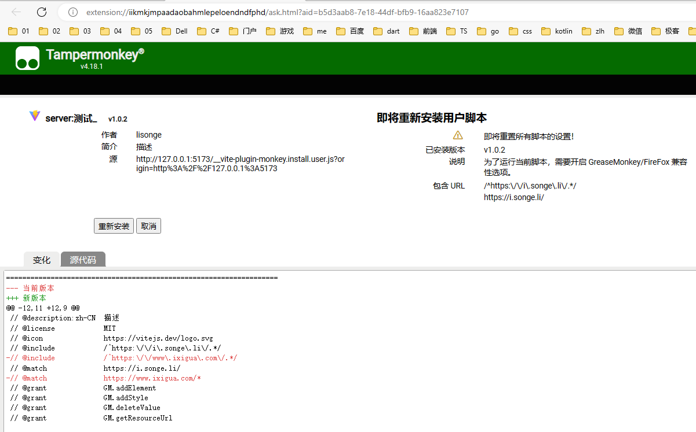
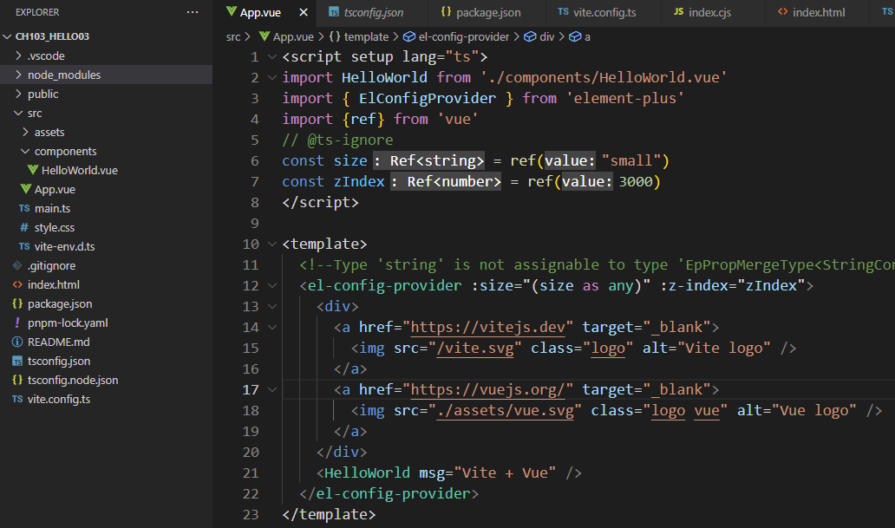

# vite-plugin-monkey

<!-- -  -->
- <../imgs/vite-plugin-monkey/communicate_to_tm.png>

# element-plus

<!-- -  -->
- <../imgs/ep/element-plus-size-error.png>
- 在 <https://github.com/vuejs/language-tools/issues/176> 找到忽略 `template` 中类型报错的方法；
<!-- -  -->
- <../imgs/ep/template_ignore_ts_error.png>

# End
